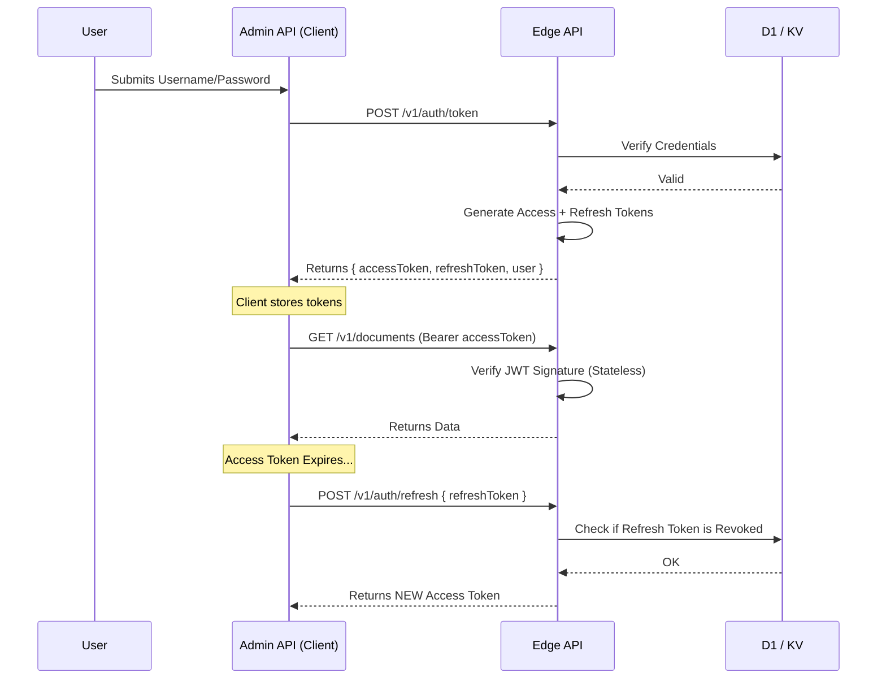

# Authentication & Capabilities

EdgePress uses a secure, stateless authentication system designed for distributed environments. It combines standard **JWT Bearer Tokens** with a granular **Capability** system to control access.

## The Auth Flow

We use a dual-token strategy:
1.  **Access Token (Short-lived)**: Used for API requests. Valid for 10-15 minutes.
2.  **Refresh Token (Long-lived)**: Used to get new Access Tokens. Stored securely.



## Capabilities: Granular Access Control

We don't just check "Is this an Admin?". We check "Can this user `edit_document`?".

Capabilities are strings like `cap_read_document`, `cap_write_document`, `cap_publish_release`.

### How it works
1.  When a user logs in, their capabilities are baked into the `user` object.
2.  The API endpoints enforce these capabilities.
    ```js
    // Internal Domain Logic Example
    if (!user.hasCapability('cap_publish')) {
      throw authError("AUTH_FORBIDDEN", "Missing capability: cap_publish");
    }
    ```

## Endpoints

### Login
**`POST /v1/auth/token`**
Exchange credentials for tokens.

### Refresh
**`POST /v1/auth/refresh`**
Get a fresh access token using a valid refresh token.

### Logout
**`POST /v1/auth/logout`**
Revoke a refresh token. This effectively kills the session once the short-lived access token expires.

## SDK Usage

The canonical SDK handles the complexity for you, including automatic token refreshing.

<<< @/snippets/sdk-auth.js
